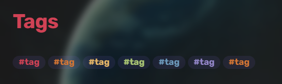

# Aura

Aura is a minimal theme.

## Installation

To install the theme

-   Open Obsidian Settings
-   Go to Appearance and click Manage
-   Under community themes search for `Aura`
-   Then click the `Install and Use` button

## Features

-   Custom **checkboxes**

    

-   Rainbow Tags

    

-   Rainbow Folders

    

## Credits

-   Wasp theme by [Santi Younger](https://github.com/santiyounger)
-   Sanctum by [jdanielmourao](https://github.com/jdanielmourao)
-   Callouts & Colored Folders by [Anubis](https://github.com/AnubisNekhet)
-   Workspace background by [Farouk](http://github.com/faroukx)