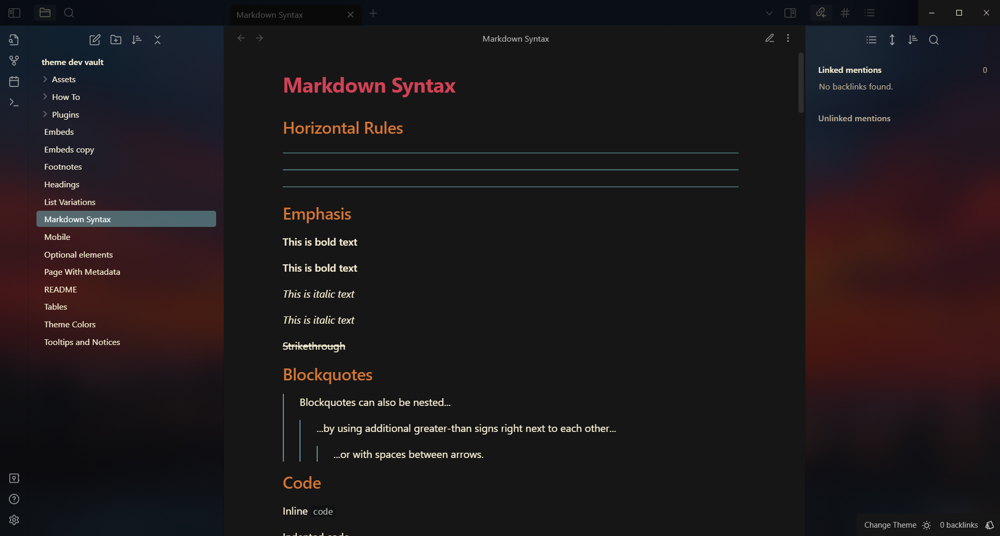
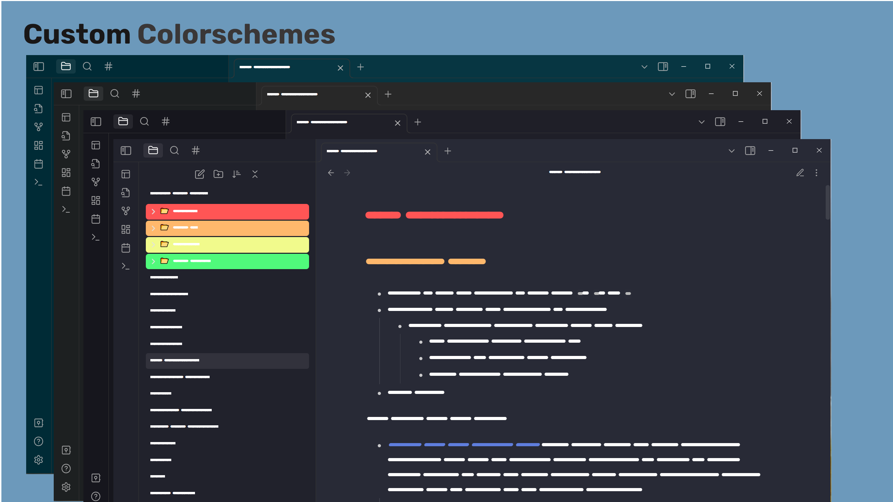
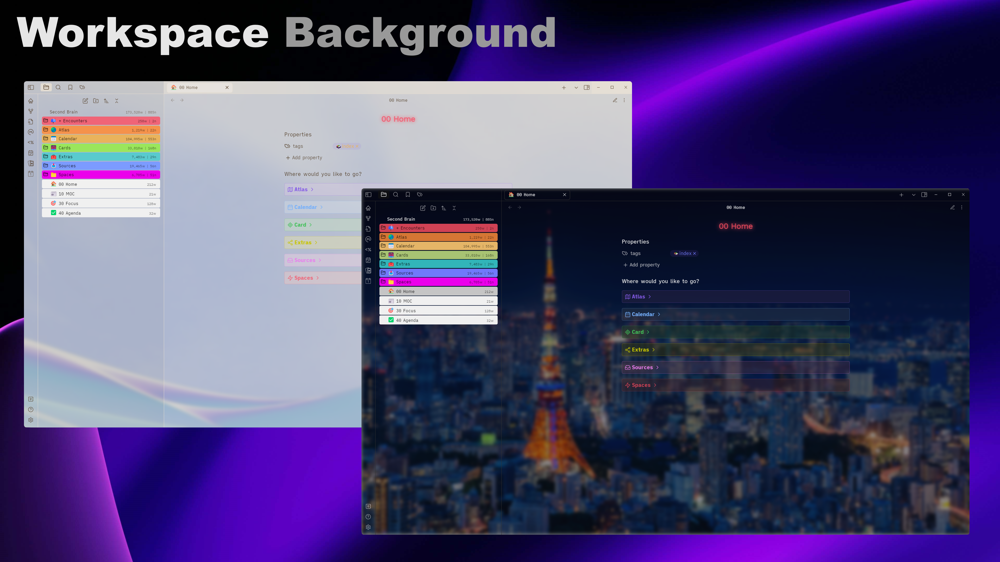
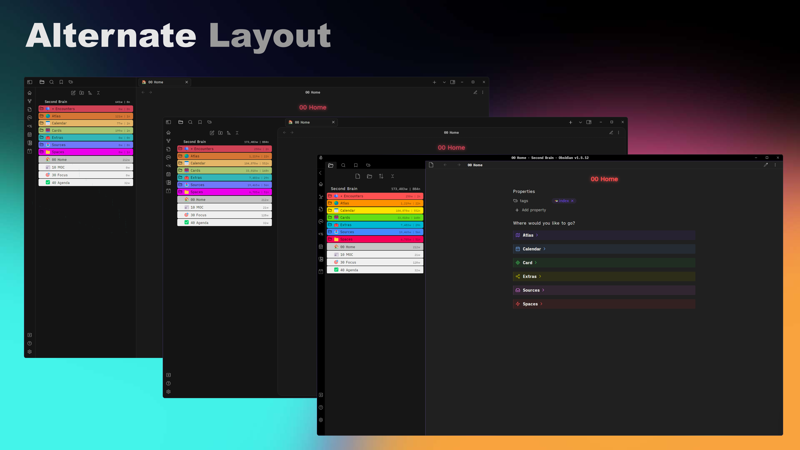
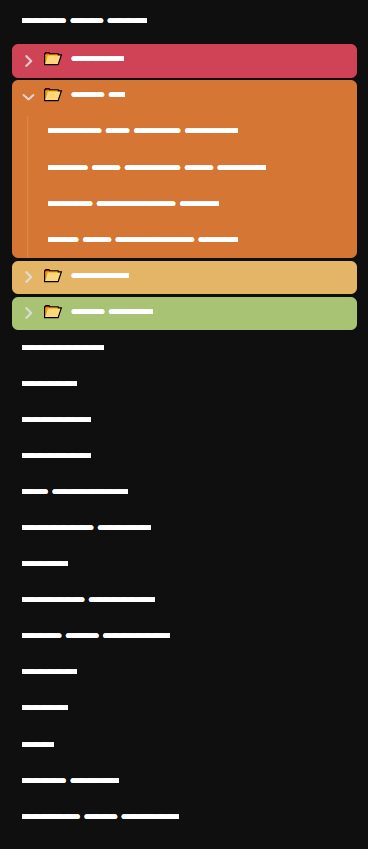
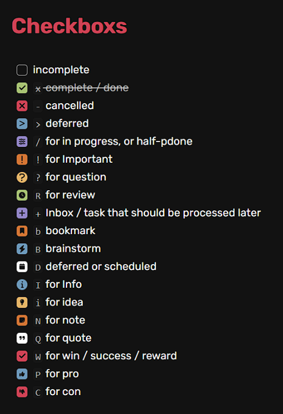

# Aura

## Installation

To install the theme

-   Open Obsidian Settings
-   Go to Appearance and click Manage
-   Under community themes search for `Aura`
-   Then click the `Install and Use` button

## Features

## Custom Colorschemes

Change the look of you workspace with colorschemes

### Workspace Background

Customize your workspace with custom background images

## Alternate Layout

Make your workspace more rounded

### Rainbow Folders

Make your folders look awesome

### Custom **checkboxes**

Unveal the true power of checkboxes

## Credits

-   Callouts & Colored Folders by [Anubis](https://github.com/AnubisNekhet)
-   Workspace background and card layout by [Farouk](http://github.com/faroukx)
