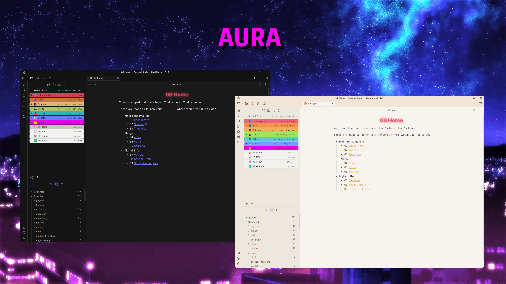
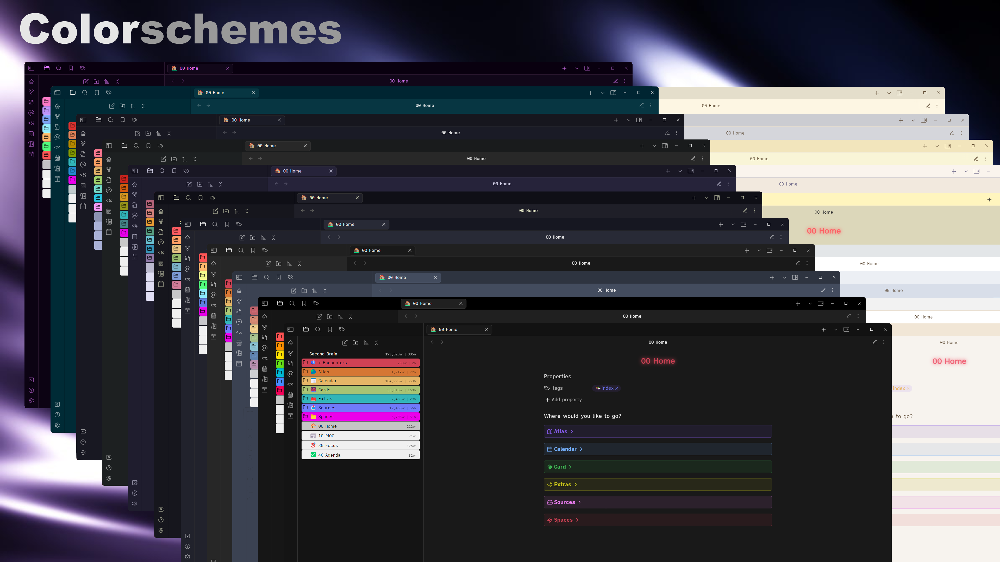
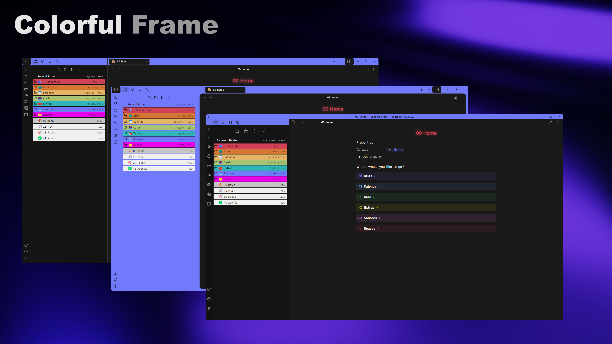
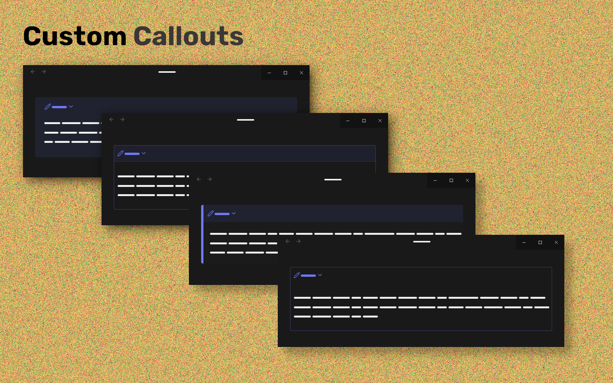

# Aura

## Installation

To install the theme

-   Open Obsidian Settings
-   Go to Appearance and click Manage
-   Under community themes search for `Aura`
-   Then click the `Install and Use` button

## Features

### Custom Colorschemes

Change the look of you workspace with colorschemes

### Workspace Background

Customize your workspace with custom background images

### Alternate Layout

Make your workspace more rounded

### Colorful Frame

Change the frame color as per your liking

### Rainbow Folders

Make your callouts pop out

### Rainbow Folders

Make your folders look awesome

### Custom checkboxes

Unveal the true power of checkboxes

## Credits
- [Anubis](https://github.com/AnubisNekhet)
   - Callouts
   - Floating Status bar
   - File & Folder Icons
-  [Farouk](http://github.com/faroukx)
	- Card layout
 	- Workspace background 
